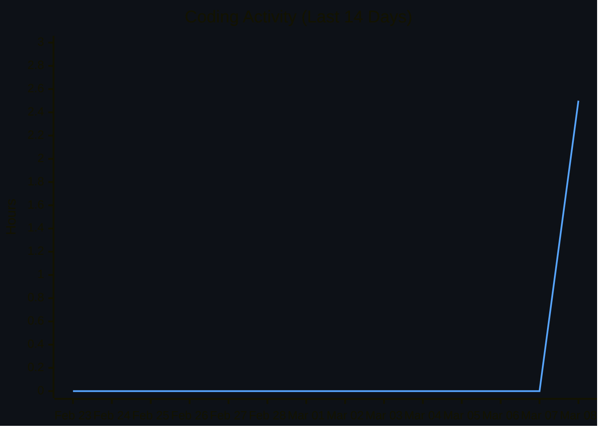
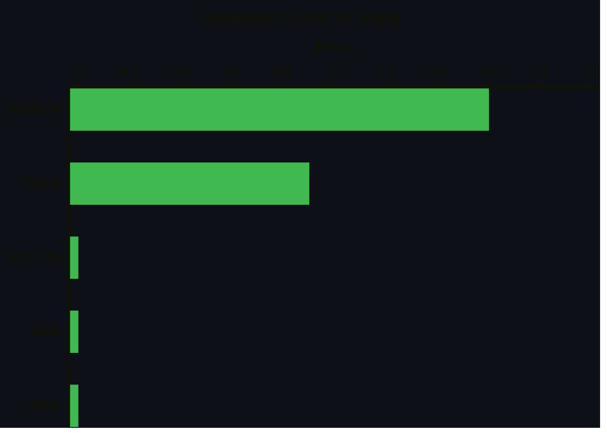

### My username's Hasganter but feel free to call me by *any* shorthand you like

Just another regular ol' coding enthusiast who learns by throwing himself into projects and finding his way out eventually.

Sometimes i code, other times i document until i code again.

Most of my repos are private, unfortunately i couldn't share much of my journey publicly. Of course i have some filtered public repos that i can share, and more on the way!

<!-- WAKATIME:START -->

## Stats (Last 14 Days)
> Total: **2.5h** · Daily avg: **0.2h** · Streak: **1 days** · Best day: **Mar 08** (2.5h) · Top lang: **Markdown** (1.6h) · Most productive: **Sundays**
>
> 30-day daily avg: **0 secs**
<!-- WAKATIME:END -->

***

#### Join me in Project TEST - Co-owner

